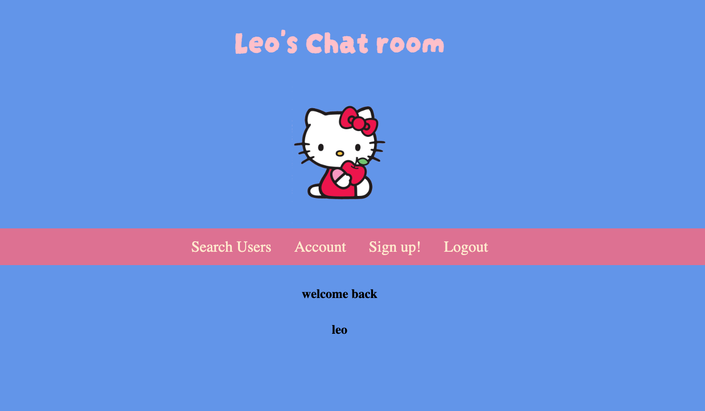
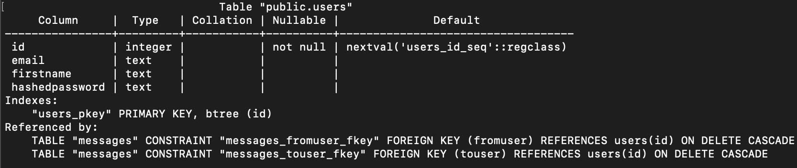
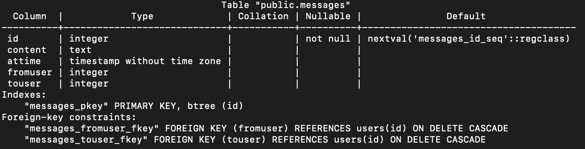

# README


## Leo's Chat room
Built to recreate a basic 2000s chat room.



## usage
Communication is an essential part to living in a complex society. Technology allows us to be better connected than ever,
messaging is an essential part to modern communication and its implications are exponential.


## instructions

- 1. simply create an account.
- 2. Select search from the menu and type in your friends email address.
- 3. if it exists in database then you will be able to leave them messages.
- 4. If your friend is loggedin then you can send messages in realtime.

## Data

chat_room database contains 2 tables. `users` and `messages`.




## strengths

- uses web sockets which allows for realtime chatting.
- css formated to work on mobile devices and desktop

## extensions 

- groupchats.
- adding friends.
- sending more than just raw text.

## limitations

- render can be extremely slow.
- satisfys basic chatroom functionality.
- still very minimal viable product for a basic chatroom.
- With these sockets I wanna make it so it goes into db automatically and doesn’t refresh page to update form to send.


### libraries
- Flask
- Gunicorn
- psycopg2
- bcrypt
- datetime
- flask_socketio

### License

`MIT License`

`Copyright (c) 2018 Render Developers`

Permission is hereby granted, free of charge, to any person obtaining a copy
of this software and associated documentation files (the "Software"), to deal
in the Software without restriction, including without limitation the rights
to use, copy, modify, merge, publish, distribute, sublicense, and/or sell
copies of the Software, and to permit persons to whom the Software is
furnished to do so, subject to the following conditions:

The above copyright notice and this permission notice shall be included in all
copies or substantial portions of the Software.

THE SOFTWARE IS PROVIDED "AS IS", WITHOUT WARRANTY OF ANY KIND, EXPRESS OR
IMPLIED, INCLUDING BUT NOT LIMITED TO THE WARRANTIES OF MERCHANTABILITY,
FITNESS FOR A PARTICULAR PURPOSE AND NONINFRINGEMENT. IN NO EVENT SHALL THE
AUTHORS OR COPYRIGHT HOLDERS BE LIABLE FOR ANY CLAIM, DAMAGES OR OTHER
LIABILITY, WHETHER IN AN ACTION OF CONTRACT, TORT OR OTHERWISE, ARISING FROM,
OUT OF OR IN CONNECTION WITH THE SOFTWARE OR THE USE OR OTHER DEALINGS IN THE
SOFTWARE.


https://project2-siaj.onrender.com/


This is the [Flask](http://flask.pocoo.org/) [quick start](http://flask.pocoo.org/docs/1.0/quickstart/#a-minimal-application) example for [Render](https://render.com).

The app in this repo is deployed at [https://flask.onrender.com](https://flask.onrender.com).

## Deployment

Follow the guide at https://render.com/docs/deploy-flask.


- [README](#readme)
  - [Leo's Chat room](#leos-chat-room)
  - [usage](#usage)
  - [instructions](#instructions)
  - [Data](#data)
  - [strengths](#strengths)
  - [extensions](#extensions)
  - [limitations](#limitations)
    - [libraries](#libraries)
    - [License](#license)
  - [Deployment](#deployment)
- [Week 11 Day 1](#week-11-day-1)
  - [Warm up](#warm-up)
  - [Objectives](#objectives)
  - [Password encryption](#password-encryption)
    - [Food truck stage 5](#food-truck-stage-5)
  - [Project 2](#project-2)
    - [Key requirements](#key-requirements)
    - [Project ideas](#project-ideas)
    - [Guidelines](#guidelines)
    - [Final tips](#final-tips)
    - [Deploying online](#deploying-online)
      - [render.com](#rendercom)
      - [Heroku](#heroku)

# Week 11 Day 1

## Warm up

Create a Flask app (no need for DB) that shows:

- If the user does not have a session: "I don't remember you", with a form for inputting a name
- If the user has a session: a message with the user's name somewhere in the text, and a button "Forget me" that removes the session

**Extension:** Extend your login form to include more things the user can add (e.g. DOB, favourite colour, etc.). The "I remember you" page should then display each value with a separate "Forget" button for each. If the user clicks "Forget" on the name, the page goes back to the "I don't remember you" page; for the others, the section should just be removed from the page. Try to use reusable functions/routes (you will likely need a Jinja template for this too).

## Objectives

- Password encryption using `bcrypt`
- Introducing Project 2

## Password encryption

Never store passwords in plaintext! Before storing the user's password in the DB, use `bcrypt` (Python module) to encrypt it.

```py
# get plain_text_password from e.g. POST /signup form data

# hash the password with a 'salt' - a random string so that two same passwords still have different hash
# note the '.encode()' - this is needed because bcrypt accepts bytes not string type
hashed_password = bcrypt.hashpw(plain_text_password.encode(), bcrypt.gensalt())

# now hashed_password can be stored in DB
```

Then to check the password:

```py
# get plain_text_password from e.g. POST /login form data
# get hashed_password from DB

isValidPassword = bcrypt.checkpw(plain_text_password.encode(), hashed_password)

# now isValidPassword can be used to determin if user is properly authenticated
```

### Food truck stage 5

1. Add a `password_hash` column to your `users` table. You can either re-create your table, or use `ALTER TABLE`:
   
```sql
ALTER TABLE users ADD COLUMN password_hash TEXT;
```

2. Add a sign up form that asks the user for their email, name and password and updates the DB with the information, hashing the password before saving it in the DB. Redirect the user to the login form after they have signed up.

3. Modify your login form to check for the password. Make sure you test it for both correct and incorrect passwords, as well as logging out and back in.

**Extension:** if you haven't already, do the first point of the [extension from stage 4](../W10/W10D3.md#extensions). Then, allow admins to reset passwords.

**Extension 2:** Improve your sign up and login forms (e.g. 're-enter your password' field on sign up, validation for existing users, guidance for failed logins, limited password attempts, question/answers or password hints)

## Project 2

### Key requirements

It's time to build your own full stack application! Your app must have:

- At least two tables, one of which should hold user information
- At least one example each of the CRUD ops
- An implementation of the Flask `session` (do not store your secret key in your public repo!)
- Jinja templates with at least one CSS stylesheet
- Be deployed online

You must also have a GitHub repository on github.com containing:

- Frequent commits throughout the whole development process with helpful commit messages
- A `README.md` file with concise explanations of what you did (including overall approach, technologies used, unsolved problems etc.), as well as instructions for local setup of your app
- A [`.gitignore`](../../.gitignore)
- Your final source code
- A link to your hosted app

You will also be doing a short (5min) presentation/demo to the rest of the class with Q&A time after.

### Project ideas

You can come up with you own idea for anything **as long as it satisfies the technical [key requirements](#key-requirements)** listed above, but here are some potential ideas:

**Cheerups**
The world is a depressing place. Create an app that will allow people to create and share "cheerups" - happy little quips to brighten other people's days. Members should be able to interact with the cheerups (up/downvote, save to faves, repost etc.)

**Dating online**
Online dating is a multibillion dollar industry. Produce a new online dating platform to help people to connect. Members should be able to update their profile and connect with/message others.

**Recipe sharing**
Allow users to share their recipes, with options to search for recipes by ingredient and add reviews or comments.

**Event planning**
Create an app to allow members to share events (with tags for the category, e.g. art, music, board games etc.) Members should be able to search for and click 'interested/going' to events.

**Important: Focus on getting an MVP up first (this should be done by W12D1 at the latest, so you have at least one lesson to do any polishing)**. Then, think about how you can extend your app, e.g. adding JS/CSS, integrating with an open API, different types of users, etc. Use your creativity to make the app your own!

### Guidelines

- You will be working **individually** for this project, but we'll be guiding you along the process and helping you as you go.
- Do **not** copy from other people's implementations. That includes online tutorials, YouTube videos, etc. This just isn't a good way to learn. You're trying to grow your skills to build any app, not just ones that have tutorials out there.
- You **can** copy from StackOverflow answers, tutorials/examples (e.g. "how to use X UI library"), and examples from official documentation like MDN. **However**, if it's more than one line of code and you don't change it substantially, you **must** attribute the source (in a comment).
- Your project is due **W12D3 before class starts**. Use your project time wisely, and don't wait until Friday to ask questions! There will be a _little_ bit of time on Saturday morning for you to do last minute prep, but most of the day will be presentations. You may use slides (2 max) for your presentation, but you also need to do a live demo of your working app. Be prepared to show your code and explain how things work.

### Final tips

- Break down the project into small steps - what's the smallest step that you can test first? Use comments/pseudo code to plan your to-do list and overall structure, or, if you want to go the extra mile (and get a taste test of software dev in industry), check out Trello or Jira.
- Store your database seeding code in `SQL` files for easy reset of your tables
- Commit early, commit often

### Deploying online

We will be using render.com to deploy the PostgreSQL DB and website. Previous cohorts used to use Heroku, but the free tier general access has been ended 🥲 GA are starting rollout of GitHub Campus subscriptions for GA students, which will allow continuation of free access to Heroku, but this is in its beginning stages (and instructors don't have access). The GitHub Campus and Heroku instructions have been included in case you want to try, but **set up render.com first to ensure you can actually submit your project (more guidance will be available for render.com since instructors can also access), then play around with Heroku if you have time**.

#### render.com

1. Create account at https://dashboard.render.com/register
2. New > PostgreSQL > when it's provisioned, copy the Internal Database URL and PSQL Command
3. Paste the PSQL Command from step 2 into terminal > add a table `mytable` and at least 1 row
4. Go to https://github.com/bwl-owl/flask-render and click Use this template > Create a new repository > Give it a name (you can call it `project2` for now if you haven't decided what you want to build)
5. New > Web Service > link your GitHub and select the `project2` (or whatever you called it) repo you just created
6. In web service go to Environment > Environment Variables > Add `DATABASE_URL` to Key and the Internal Database URL you copied in step 2 to Value > Save
7. When the deploy is finished, go to the URL and check your webpage displays your table results
8. Now you're ready to `git clone` and start making changes (remember to create a virtual environment as well) 
   - If you install any additional Python modules, you need to also add them to the `requirements.txt` file
   - To add additional variables/secrets (e.g. for your Flask session), the process is the same as step 6 - just change the Key and Value to whatever you're adding

#### Heroku

1. Set up GitHub Campus (you will get a link DM'd to you in Slack) and create a Heroku account at https://www.heroku.com/ 
2. Install the [Heroku CLI tool](https://devcenter.heroku.com/articles/getting-started-with-python#set-up)
3. Go to https://github.com/bwl-owl/flask-heroku and click Use this template > Create a new repository > Give it a name (you can call it `project2` for now if you haven't decided what you want to build) > Clone it
4. In your Git repository directory:
   - Run `heroku login` and `heroku create project2` to create your app
   - Run `heroku addons:create heroku-postgresql:hobby-dev` to create your DB - this will tell you your `DATABASE_URL` (which you can also access via https://dashboard.heroku.com/apps > Settings > Config Vars)
5. Create a `mydatabase` database locally with a table `mytable` and insert at least one row
6. Check that your app runs fine locally before proceeding, then run `heroku pg:push database_name_here <DATABASE_URL>` (replace `<DATABSE_URL>` with the value you got in step 4)
7. Go to your [Heroku dashboard](https://dashboard.heroku.com/) and run `heroku git:clone -a project2` and `git push heroku main`
8. Run `heroku open` to open your app and `heroku logs` to see logs
9. Now you're ready to start making changes (remember to create a virtual environment as well) 
   - If you install any additional Python modules, you need to also add them to the `requirements.txt` file
   - To add additional variables/secrets (e.g. for your Flask session), use `heroku config:set <SECRET_KEY>=<SECRET_VALUE>` (and access same way as `DATABASE_URL` in step 4 - view in Heroku web UI and access in Python code using `<SECRET_VALUE> = os.environ.get("<SECRET_KEY>", "<default_value>"`)

[Heroku cheatsheet](https://gist.git.generalassemb.ly/katie/2b04e662ffc32713aad1b07747aceed9)